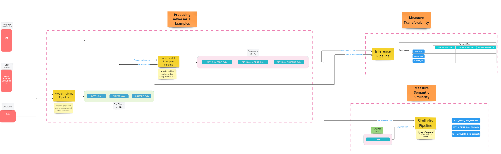

## Relevant Work:

### On the Transferability of Adversarial Attacks against Neural Text Classifier, Liping Yuan 2021

All the models are investigated under two proposed attack algorithms, PWWS (Ren et al., 2019) and GA (Alzantot et al., 2018). The sets of allowed word substitutions are based on the synonyms created in WordNet (Miller, 1995), and for any word in a text, the word to replace must have the same part-of-speech (POS) as the original one1 . For consistency, we report the robust accuracy under GA attack without using an LM. 

Zang et al. (2020) suggested that existing textual attack algorithms can roughly be divided into two categories: greedy and population based algorithms. PWWS and TextFooler (Jin et al., 2020) fall into the first category while GA and PSO (Zang et al., 2020) belong to the second one. We chose one attack algorithm in each category when investigating the transferability among neural models and use TextFooler to evaluate the generalizability of the proposed method in Section 3.3. 

- Contributions:
    - Model parameters impact on transferability

- Limitations: 
    - Only 2 attacks. 
    - Did not benchmark which attack is better. 
    - Did not quantify attacks parameters on transferability. 

###  Adversarial GLUE: A Multi-Task Benchmark for Robustness Evaluation of Language Models, Boxin Wang 2021
Generates adversarially created datasets using only “good attacks”. 

- Limitations: 
    - Did not quantify or publish results of Transferability and Fidelity. 
    - Only adversarial examples that can successfully transfer to the other two models will be kept for the next round of fidelity filtering
    - Word-level adversarial examples, we use word modification rate. If larger than 15% words in sample are perturbed, then they are filtered out.
    - For sentence-level adversarial examples, we use BERTScore to evaluate the semantic similarity. For each sentence-level attack, adversarial examples with the highest similarity scores are kept to guarantee their semantic closeness to the benign samples. 

## Inspiration: 

A good model language must be robustness on out of sample data. 

Out of sample data can be produced through a method of intelligently altering the input data, so the model which is already trained on the data, produces erroneous outputs.  

Producing adversarial examples of a dataset is intended to trick the victim model, however a good adversarial example should maintain semantic simlarity from the original text. On the basis that the previous assumption is met, it is expected that similar models will perform similarily on the adversarial example (i.e AlBERT, BERT, DistilBERT). 

If the similar models do not perform similairily on the adversarial example means that the method of producing the adversarial example was not transferable to another model. 

However there is not metric nor tooling which quanitfies the quality of the adversarial attack. 

Futhermore, if two similar models are unable to have similar performance, even after human intervention can confirm that the quality of the adversarial example meets the two criteria, it suggests that the models are not similar at all. 

## Objective:

- Quanitfy the top `N` Adversarial Attacks for Language models on the General Language Understanding Evaluation (GLUE) benchmark dataset. 
- What exactly makes a good attack?
    - Constraints
    - Search space 
    - etc.

## Design: 

Link to live board [here](https://miro.com/app/embed/uXjVMQeQn-0=/?pres=1&frameId=3458764552760387719&embedId=230974042676)

<figure align="center">
  
    <figcaption>Fig.1 - Design.</figcaption>
</figure>

